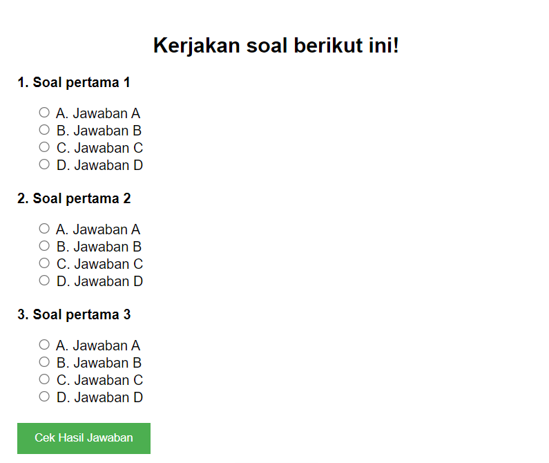

# Aplikasi Quiz

Aplikasi quiz berbasis web sederhana yang dibangun menggunakan HTML, CSS, dan PHP.

## Daftar Isi

- [Pendahuluan](#pendahuluan)
- [Fitur](#fitur)
- [Teknologi yang Digunakan](#teknologi-yang-digunakan)
- [Instalasi](#instalasi)

## Pendahuluan

**Aplikasi Quiz** adalah aplikasi berbasis web yang memungkinkan pengguna untuk mengikuti kuis dengan berbagai pertanyaan. Setiap jawaban akan dinilai, dan pengguna dapat melihat skor mereka di akhir kuis. Aplikasi ini menggunakan PHP untuk menangani logika di server dan HTML/CSS untuk tampilan antarmuka yang bersih dan responsif.

## Fitur

- Pengguna dapat mengikuti kuis dengan berbagai pertanyaan.
- Skor kuis ditampilkan di akhir setelah semua pertanyaan dijawab.
- Desain responsif yang bisa digunakan di berbagai perangkat.
- Soal dapat disimpan di database (opsional).
- Navigasi pertanyaan secara dinamis.



## Teknologi yang Digunakan

- **HTML** - Untuk struktur halaman web.
- **CSS** - Untuk styling dan desain antarmuka.
- **PHP** - Untuk logika backend dan pengolahan data kuis.
- **SQLite/MySQL** (opsional) - Untuk menyimpan data soal dan skor (jika menggunakan database).

## Instalasi

1. Clone repositori ini ke direktori lokal:
   ```bash
   git clone https://github.com/rffdpryt/itsQuizz.git
